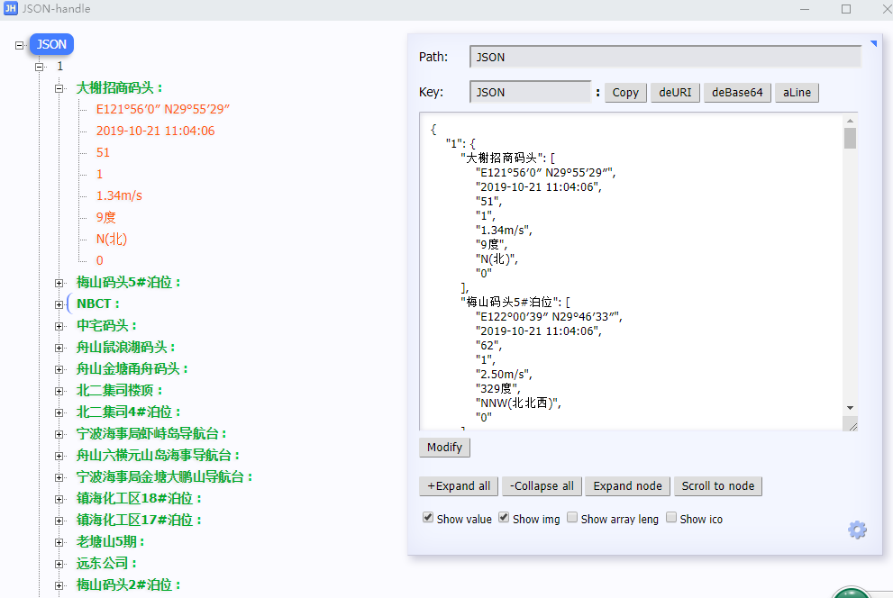

# Gson解析动态字段名的数据

json数据结构如下:

json详细数据为:

~~~~
{"1":{"大榭招商码头":["E121°56′0″ N29°55′29″","2019-10-21 14:59:46","51","1","3.74m/s","35度","NE(北东)","0"],"梅山码头5#泊位":["E122°00′39″ N29°46′33″","2019-10-21 14:59:45","62","1","5.79m/s","355度","N(北)","0"],"NBCT":["E121°52′2″ N29°55′47″","2019-10-21 14:59:45","1","1","5.53m/s","307度","NW(北西)","0"],"中宅码头":["E122°05′12″ N29°53′22″","2019-10-21 14:59:44","57","1","4.68m/s","2度","N(北)","0"],"舟山鼠浪湖码头":["E122°27′47″ N30°25′46″","2019-10-21 14:59:47","64","1","9.40m/s","328度","NNW(北北西)","0"],"舟山金塘甬舟码头":["E121°50′40″ N29°59′24″","2019-10-21 14:59:46","66","1","4.80m/s","318度","NW(北西)","0"],"北二集司楼顶":["E121°50′31″N29°55′53″","2019-10-21 14:59:45","3","1","6.53m/s","159度","SSE(南南东)","0"],"北二集司4#泊位":["E121°50′7″ N29°56′36″","2019-10-21 14:59:46","60","1","3.26m/s","2度","N(北)","0"],"宁波海事局虾峙岛导航台":["E122°18′37″ N29°44′07″","2019-10-21 14:59:46","58","1","1.39m/s","51度","NE(北东)","0"],"舟山六横元山岛海事导航台":["122.271566390991 29.688276441928","2019-10-21 14:59:45","70","1","5.28m/s","310度","NW(北西)","0"],"宁波海事局金塘大鹏山导航台":["E121°49′38″N30°04′4″","2019-10-21 14:59:45","56","1","4.42m/s","39度","NE(北东)","0"],"镇海化工区18#泊位":["E121°44′55″ N29°58′43″","2019-10-21 14:59:46","5","1","3.55m/s","340度","NNW(北北西)","0"],"镇海化工区17#泊位":["E121°45′30″ N29°58′35″","2019-10-21 14:59:44","53","1","0.19m/s","4度","N(北)","0"],"老塘山5期":["121.987252235413 30.029606404395","2019-10-21 14:59:46","85","1","1.62m/s","37度","NE(北东)","0"],"远东公司":["E122°04′07″ N29°53′10″","2019-10-21 14:59:45","50","1","2.30m/s","353度","N(北)","0"],"梅山码头2#泊位":["E122°00′03″ N29°45′59″","2019-10-21 14:59:46","7","1","4.37m/s","353度","N(北)","0"],"港吉公司":["E122°01′42″ N29°53′2″","2019-10-21 14:59:44","4","1","7.01m/s","294度","WNW(西北西)","0"],"舟山武港码头":["E122°12′40″ N29°43′45″","2019-10-21 14:59:46","65","1","5.86m/s","300度","WNW(西北西)","0"],"宁波海事局北仑山导航台":["E121°51′17″ N29°56′19″","2019-10-21 14:59:46","52","1","6.62m/s","324度","NW(北西)","0"]},"2":{"宁波海事局金塘大鹏山导航台":["E121°49′38″N30°04′4″","2019-10-21 14:59:45","56","2","0.00","0","","10000米"],"老塘山5期":["121.987252235413 30.029606404395","2019-10-21 14:59:46","85","2","0.00","0","","10000米"],"消拖1号(mmsi:412036180)":["船舶上移动点位","2019-10-21 14:59:46","59","2","0.00","0","","10000米"],"宁波桃花岛引航基地":["E122°13′51″ N29°49′29″","2019-10-21 14:59:46","6","2","0.00","0","","10000米"],"宁波海事局峙头导航台":["E122°08′03″ N29°54′09″","2019-10-21 14:59:47","54","2","0.00","0","","10000米"],"鼠浪湖能见度":["122.446489334106 30.423512738916","2019-10-21 14:59:45","83","2","0.00","0","","10000米"],"舟山六横东浪咀海事导航台":["122.115354537964 29.786131176992","2019-10-21 14:59:43","71","2","0.00","0","","10000米"],"宁波海事局虾峙岛导航台":["E122°18′37″ N29°44′07″","2019-10-21 14:59:45","55","2","0.00","0","","10000米"],"舟山武港码头":["E122°12′40″ N29°43′45″","2019-10-21 14:59:46","65","2","0.00","0","","10000米"],"舟山六横元山岛海事导航台":["122.271566390991 29.688276441928","2019-10-21 14:59:45","70","2","0.00","0","","10000米"]}}
~~~~

我们解析时,只需通过map解析就行了:

~~~~java
if (!StringUtils.isEmpty(text)) {
                Map<Object,Object> map = new Gson().fromJson(text, Map.class);
                Map<String, Object> valueMap = (Map<String, Object>)map.get("1");
                for(Map.Entry<String, Object> entry : valueMap.entrySet()){
                    String key = entry.getKey();
                    Log.e("hao", "key: "+key);
                    List<String> list = (List<String>) entry.getValue();
                    for(int i = 0; i < list.size(); i++) {
                        Log.e("hao", "i: "+list.get(i));
                    }
                }
            }
~~~~

