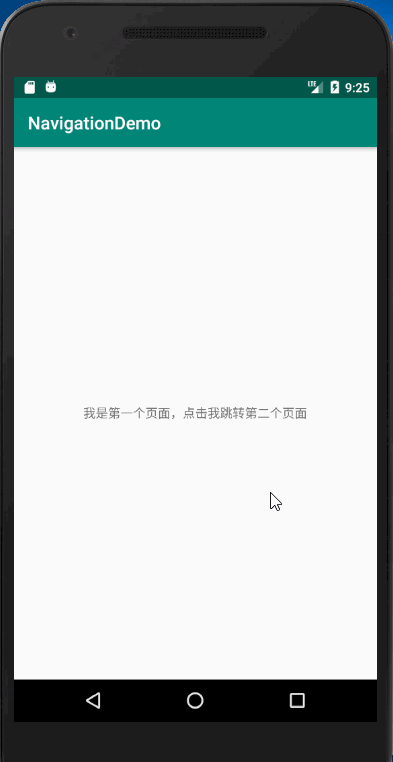
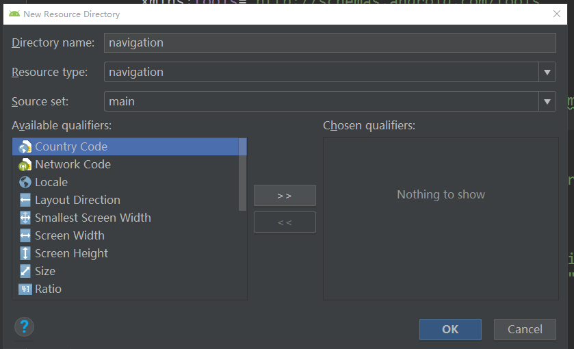

## Navigation使用（fragment之间跳转控制器）

[TOC]



### 使用

1.android studio要到3.2版本。

2.添加依赖

~~~~java
implementation "android.arch.navigation:navigation-fragment:1.0.0-alpha06"
implementation "android.arch.navigation:navigation-ui:1.0.0-alpha06"
~~~~

3.创建两个fragment: MainFragment和TwoFragment

4.res文件夹右键-->New Resource Directory , Resource type选择navigation.

5.在navigation文件夹右键 --> New -->Navigation resource file,新建xml文件`to_fragment.xml`

注意：只有Canary版本是默认打开的，如果找不到这个Navigation resource file，请手动打开：

```java
Settings -> Experimental(最后一项) -> Enable Navigation Editor
```

`to_fragment.xml`

~~~~xml
<?xml version="1.0" encoding="utf-8"?>
<navigation xmlns:android="http://schemas.android.com/apk/res/android"
            xmlns:app="http://schemas.android.com/apk/res-auto"
            xmlns:tools="http://schemas.android.com/tools"
            app:startDestination="@id/MainFragment">

    <fragment
        android:id="@+id/MainFragment"
        android:name="com.example.administrator.navigationdemo.MainFragment"
        android:label="fragment_first"
        tools:layout="@layout/fragment_main">
        <action
            android:id="@+id/action_firstFragment_to_secondFragment"
            app:destination="@id/TwoFragment"
            app:enterAnim="@anim/nav_default_enter_anim"
            app:exitAnim="@anim/nav_default_exit_anim"
            app:popEnterAnim="@anim/nav_default_pop_enter_anim"
            app:popExitAnim="@anim/nav_default_pop_exit_anim"/>
    </fragment>
    <fragment
        android:id="@+id/TwoFragment"
        android:name="com.example.administrator.navigationdemo.TwoFragment"
        android:label="fragment_second"
        tools:layout="@layout/fragment_two">
    </fragment>
</navigation>
~~~~

加入`xmlns:tools="http://schemas.android.com/tools"`是为了方便在design视图中查看。

`startDestination`标签表示刚开始显示的fragment的id。 `action`标签表示需要跳转的动作，当需要跳转的时候，需要调这个`action`的id，`destination`表示要跳转到的fragment。

6.在activity中加入：

~~~~xml
<?xml version="1.0" encoding="utf-8"?>
<android.support.constraint.ConstraintLayout
    xmlns:android="http://schemas.android.com/apk/res/android"
    xmlns:app="http://schemas.android.com/apk/res-auto"
    xmlns:tools="http://schemas.android.com/tools"
    android:layout_width="match_parent"
    android:layout_height="match_parent"
    tools:context=".MainActivity">

    <fragment
        android:name="androidx.navigation.fragment.NavHostFragment"
        android:id="@+id/fragment"
        android:layout_width="match_parent"
        android:layout_height="match_parent"
        app:defaultNavHost="true"
        app:navGraph="@navigation/to_fragment" />


</android.support.constraint.ConstraintLayout>
~~~~

`navGraph`标签声明的我们写好的navigation文件。

在`MainActivity`中重写`onSupportNavigateUp`方法：

~~~~java
 @Override
    public boolean onSupportNavigateUp() {
        Fragment fragment = getSupportFragmentManager().findFragmentById(R.id.fragment);
        return NavHostFragment.findNavController(fragment).navigateUp();
    }
~~~~


7.在fragment中添加：

`MainFragment.java`

~~~~JAVA
public class MainFragment extends Fragment {

    private TextView tv_fragment_main;

    public static MainFragment newInstance() {
        MainFragment fragment = new MainFragment();
        return fragment;
    }

    @Override
    public View onCreateView(LayoutInflater inflater, ViewGroup container, Bundle savedInstanceState) {
        View v = inflater.inflate(R.layout.fragment_main, container, false);
        initView(v);
        return v;
    }

    private void initView(final View view) {
        tv_fragment_main = (TextView) view.findViewById(R.id.tv_fragment_main);
        tv_fragment_main.setOnClickListener(new View.OnClickListener() {
            @Override
            public void onClick(View v) {
                //声明要跳转的动作（action标签的id）--> 跳转到TwoFragment
                Navigation.findNavController(view).navigate(R.id.action_firstFragment_to_secondFragment);
            }
        });
    }
}
~~~~

`TwoFragment.java`

~~~~JAVA
public class TwoFragment extends Fragment {

    private TextView tv_fragment_main;
    private TextView tv_fragment_two;

    public static TwoFragment newInstance() {
        TwoFragment fragment = new TwoFragment();
        return fragment;
    }

    @Override
    public View onCreateView(LayoutInflater inflater, ViewGroup container, Bundle savedInstanceState) {
        View v = inflater.inflate(R.layout.fragment_two, container, false);
        initView(v);
        return v;
    }

    private void initView(final View view) {

        tv_fragment_two = (TextView) view.findViewById(R.id.tv_fragment_two);
        tv_fragment_two.setOnClickListener(new View.OnClickListener() {
            @Override
            public void onClick(View v) {
                //回到MainFragment
                Navigation.findNavController(view).navigateUp();
            }
        });
    }
}
~~~~

