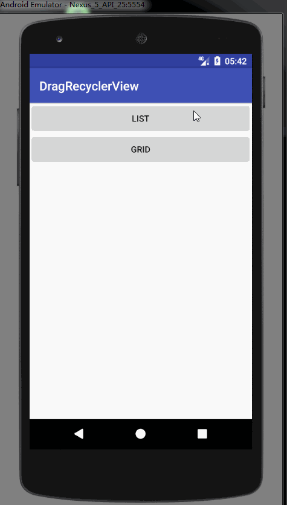

# RecyclerView自定义拖拽工具类--ItemTouchHelper

[TOC]

## 简介

ItemTouchHelper是一个RecyclerView的侧滑删除和拖拽移动的工具类。

## 效果

 

## 使用

假设我那写好了一个自定义的ItemTouchHelper的callback，那如何使用呢？

很简单，先初始化自定义的ItemTouchHelper的callback，然后调用自定义的ItemTouchHelper的callback的attachToRecyclerView（）方法就行了。

~~~~JAVA
ItemTouchHelper itemTouchHelper = new ItemTouchHelper(new MyItemTouchCallback(adapter));
itemTouchHelper.attachToRecyclerView(recyclerView);
~~~~

代码中的MyItemTouchCallback就是我们自定义的ItemTouchHelper的callback。

## 自定义ItemTouchHelper的callback

首先，继承ItemTouchHelper.Callback，必须要实现三个方法：

~~~JAVA
 /**
     * 返回true,开启长按拖拽
     * @return
     */
    @Override
    public boolean isLongPressDragEnabled() {
        return false;
    }

    /**
     * 返回true，开启swipe事件
     * @return
     */
    @Override
    public boolean isItemViewSwipeEnabled() {
        return true;
    }

    /**
     * ItemTouchHelper支持事件方向判断，但是必须重写当前getMovementFlags来指定支持的方向
     * 最后通过makeMovementFlags（dragFlag，swipe）创建方向的Flag
     * @param recyclerView
     * @param viewHolder
     * @return
     */
    @Override
    public int getMovementFlags(RecyclerView recyclerView, RecyclerView.ViewHolder viewHolder) {

        if (recyclerView.getLayoutManager() instanceof GridLayoutManager) {
          	//设置为GridLayoutManager时，即效果图的网格图可拖动的效果
          	//设置可以上下左右拖动
            final int dragFlags = ItemTouchHelper.UP | ItemTouchHelper.DOWN | ItemTouchHelper.LEFT | ItemTouchHelper.RIGHT;
            final int swipeFlags = 0;
            return makeMovementFlags(dragFlags, swipeFlags);
        } else {
          	//即效果图第一个线性列表的效果
          	//设置可以上下拖动
            final int dragFlags = ItemTouchHelper.UP | ItemTouchHelper.DOWN;
            final int swipeFlags = 0;
            return makeMovementFlags(dragFlags, swipeFlags);
        }
    }
~~~

除了上述的方法，还可以重写`onMove()`和`onSwiped()`方法，在这里边写回调，然后在activity或fragment中实现。

还有以下方法，看代码注释即可，毕竟简单。

~~~~JAVA
 /**
     * 由ItemTouchHelper调用回收的onDraw回调，用来自定义视图对用户交互的响应
     *
     * @param c     Canvas
     * @param recyclerView
     * @param viewHolder
     * @param dX    由用户行为引起的水平位移量
     * @param dY    由用户行为引起的垂直位移量
     * @param actionState   视图中的交互类型（ ACTION_STATE_DRAG 或者 ACTION_STATE_SWIPE ）
     * @param isCurrentlyActive 如果该视图当前被用户或false控制，则它将简单地返回到原始状态
     */
    @Override
    public void onChildDraw(Canvas c, RecyclerView recyclerView, RecyclerView.ViewHolder viewHolder, float dX, float dY, int actionState, boolean isCurrentlyActive) {
        if (actionState == ItemTouchHelper.ACTION_STATE_SWIPE) {
            //滑动时改变Item的透明度
            final float alpha = 1 - Math.abs(dX) / (float) viewHolder.itemView.getWidth();
            viewHolder.itemView.setAlpha(alpha);
            viewHolder.itemView.setTranslationX(dX);
        } else {
            super.onChildDraw(c, recyclerView, viewHolder, dX, dY, actionState, isCurrentlyActive);
        }
    }

    /**
     * 当ViewHolder swiped或拖动ItemTouchHelper时调用
     * 
     * @param viewHolder
     * @param actionState 参数：ACTION_STATE_IDLE;ACTION_STATE_SWIPE;ACTION_STATE_DRAG
     */
    @Override
    public void onSelectedChanged(RecyclerView.ViewHolder viewHolder, int actionState) {

        //ItemTouchHelper.ACTION_STATE_IDLE 空闲状态
        if (actionState != ItemTouchHelper.ACTION_STATE_IDLE) {
            if (background == null && bkcolor == -1) {
                Drawable drawable = viewHolder.itemView.getBackground();
                if (drawable == null) {
                    bkcolor = 0;
                } else {
                    background = drawable;
                }
            }
            viewHolder.itemView.setBackgroundColor(Color.LTGRAY);
        }
        super.onSelectedChanged(viewHolder, actionState);
    }

    /**
     * 拖拽完成时调用
     * @param recyclerView
     * @param viewHolder
     */
    @Override
    public void clearView(RecyclerView recyclerView, RecyclerView.ViewHolder viewHolder) {
        super.clearView(recyclerView, viewHolder);

        viewHolder.itemView.setAlpha(1.0f);
        if (background != null) viewHolder.itemView.setBackgroundDrawable(background);
        if (bkcolor != -1) viewHolder.itemView.setBackgroundColor(bkcolor);
        //viewHolder.itemView.setBackgroundColor(0);

        if (onDragListener!=null){
            onDragListener.onFinishDrag();
        }
    }
~~~~

另外，如果只是简单的效果，可以继承ItemTouchHelper.SimpleCallback。

## 自定义ItemTouchHelper.callback完整代码

~~~~JAVA
public class MyItemTouchCallback extends ItemTouchHelper.Callback {

    private ItemTouchAdapter itemTouchAdapter;
    public MyItemTouchCallback(ItemTouchAdapter itemTouchAdapter){
        this.itemTouchAdapter = itemTouchAdapter;
    }

    /**
     * 返回true,开启长按拖拽
     * @return
     */
    @Override
    public boolean isLongPressDragEnabled() {
        return false;
    }

    /**
     * 返回true，开启swipe事件
     * @return
     */
    @Override
    public boolean isItemViewSwipeEnabled() {
        return true;
    }

    /**
     * ItemTouchHelper支持事件方向判断，但是必须重写当前getMovementFlags来指定支持的方向
     * 最后通过makeMovementFlags（dragFlag，swipe）创建方向的Flag
     * @param recyclerView
     * @param viewHolder
     * @return
     */
    @Override
    public int getMovementFlags(RecyclerView recyclerView, RecyclerView.ViewHolder viewHolder) {

        if (recyclerView.getLayoutManager() instanceof GridLayoutManager) {
            final int dragFlags = ItemTouchHelper.UP | ItemTouchHelper.DOWN | ItemTouchHelper.LEFT | ItemTouchHelper.RIGHT;
            final int swipeFlags = 0;
            return makeMovementFlags(dragFlags, swipeFlags);
        } else {
            final int dragFlags = ItemTouchHelper.UP | ItemTouchHelper.DOWN;
            //final int swipeFlags = ItemTouchHelper.START | ItemTouchHelper.END;
            final int swipeFlags = 0;
            return makeMovementFlags(dragFlags, swipeFlags);
        }
    }

    @Override
    public boolean onMove(RecyclerView recyclerView, RecyclerView.ViewHolder viewHolder, RecyclerView.ViewHolder target) {
        int fromPosition = viewHolder.getAdapterPosition();//得到拖动ViewHolder的position
        int toPosition = target.getAdapterPosition();//得到目标ViewHolder的position
        //回调
        itemTouchAdapter.onMove(fromPosition,toPosition);
        return true;
    }

    @Override
    public void onSwiped(RecyclerView.ViewHolder viewHolder, int direction) {
        int position = viewHolder.getAdapterPosition();
        //回调
        itemTouchAdapter.onSwiped(position);
    }

    /**
     * 由ItemTouchHelper调用回收的onDraw回调，用来自定义视图对用户交互的响应
     *
     * @param c     Canvas
     * @param recyclerView
     * @param viewHolder
     * @param dX    由用户行为引起的水平位移量
     * @param dY    由用户行为引起的垂直位移量
     * @param actionState   视图中的交互类型（ ACTION_STATE_DRAG 或者 ACTION_STATE_SWIPE ）
     * @param isCurrentlyActive 如果该视图当前被用户或false控制，则它将简单地返回到原始状态
     */
    @Override
    public void onChildDraw(Canvas c, RecyclerView recyclerView, RecyclerView.ViewHolder viewHolder, float dX, float dY, int actionState, boolean isCurrentlyActive) {
        if (actionState == ItemTouchHelper.ACTION_STATE_SWIPE) {
            //滑动时改变Item的透明度
            final float alpha = 1 - Math.abs(dX) / (float) viewHolder.itemView.getWidth();
            viewHolder.itemView.setAlpha(alpha);
            viewHolder.itemView.setTranslationX(dX);
        } else {
            super.onChildDraw(c, recyclerView, viewHolder, dX, dY, actionState, isCurrentlyActive);
        }
    }

    /**
     * 当ViewHolder swiped或拖动ItemTouchHelper时调用
     * 
     * @param viewHolder
     * @param actionState 参数：ACTION_STATE_IDLE;ACTION_STATE_SWIPE;ACTION_STATE_DRAG
     */
    @Override
    public void onSelectedChanged(RecyclerView.ViewHolder viewHolder, int actionState) {

        //ItemTouchHelper.ACTION_STATE_IDLE 空闲状态
        if (actionState != ItemTouchHelper.ACTION_STATE_IDLE) {
            if (background == null && bkcolor == -1) {
                Drawable drawable = viewHolder.itemView.getBackground();
                if (drawable == null) {
                    bkcolor = 0;
                } else {
                    background = drawable;
                }
            }
            viewHolder.itemView.setBackgroundColor(Color.LTGRAY);
        }
        super.onSelectedChanged(viewHolder, actionState);
    }

    /**
     * 拖拽完成时调用
     * @param recyclerView
     * @param viewHolder
     */
    @Override
    public void clearView(RecyclerView recyclerView, RecyclerView.ViewHolder viewHolder) {
        super.clearView(recyclerView, viewHolder);

        viewHolder.itemView.setAlpha(1.0f);
        if (background != null) viewHolder.itemView.setBackgroundDrawable(background);
        if (bkcolor != -1) viewHolder.itemView.setBackgroundColor(bkcolor);
        //viewHolder.itemView.setBackgroundColor(0);

        if (onDragListener!=null){
            onDragListener.onFinishDrag();
        }
    }

    private Drawable background = null;
    private int bkcolor = -1;

    private OnDragListener onDragListener;
    public MyItemTouchCallback setOnDragListener(OnDragListener onDragListener) {
        this.onDragListener = onDragListener;
        return this;
    }
    public interface OnDragListener{
        void onFinishDrag();
    }

    public interface ItemTouchAdapter {
        void onMove(int fromPosition,int toPosition);
        void onSwiped(int position);
    }
}

~~~~

代码链接：http://download.csdn.net/download/huchengzhiqiang/10111505