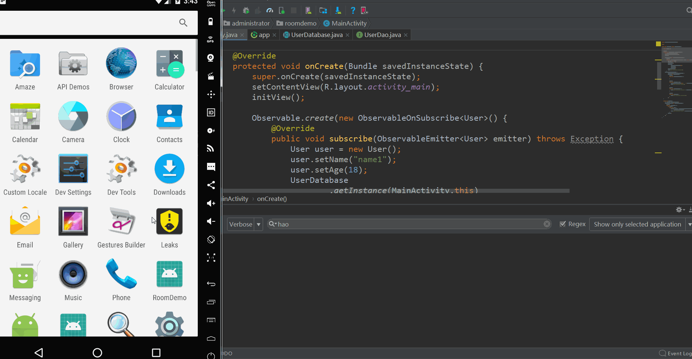

## Room数据库的使用

[TOC]

效果演示:

##### 1.添加依赖(room和rxjava的依赖)

~~~~java
    //room
    implementation 'android.arch.persistence.room:runtime:1.1.0-beta2'
    annotationProcessor 'android.arch.persistence.room:compiler:1.1.0-beta2'
    // RxJava2对room的支持(如果要在UserDao中直接返回Flowable<>则必须添加此依赖)
    //注意:版本号需要与room的版本号对应,即如下都为1.1.0-beta2
    implementation 'android.arch.persistence.room:rxjava2:1.1.0-beta2'
    //rxjava
    implementation 'io.reactivex.rxjava2:rxjava:2.1.4'
    implementation 'io.reactivex.rxjava2:rxandroid:2.0.2'
~~~~

#####2.新建bean类 User

~~~java
@Entity
public class User {
    @PrimaryKey(autoGenerate = true)//主键是否自动增长，默认为false
    private int id;
    private String name;
    private int age;

    //这里的getter/setter方法是必须的
    //这里的getter/setter方法是必须的
    //这里的getter/setter方法是必须的
    //重要的事说三遍
    public int getId() {
        return id;
    }

    public void setId(int id) {
        this.id = id;
    }

    public String getName() {
        return name;
    }

    public void setName(String name) {
        this.name = name;
    }

    public int getAge() {
        return age;
    }

    public void setAge(int age) {
        this.age = age;
    }

    @Override
    public String toString() {
        return "User{" +
                "id=" + id +
                ", name='" + name + '\'' +
                ", age=" + age +
                '}';
    }
}
~~~

注意:必须要在类的上边添加标注``@Entity``.

而且需要设置一个成员变量为主键``@PrimaryKey``, ``autoGenerate``设置为true表示主键可以自增,也就是初始化bean类的时候可以不需要初始化这个id.

#####3.新建接口UserDao

~~~~java
@Dao
public interface  UserDao {
    /**
     * 传统方法
     * @return
     */
    @Query("SELECT * FROM user")
    List<User> getAllUsers();
    
    /**
     * rxjava结合room最简便写法(可以用Flowable,Single,Maybe,但是只有Flowable,在调用以后,数据库数据更	    * 新了,会自动更新前台数据)
     *
     * @return
     */
    @Query("SELECT * FROM user")
    Flowable<List<User>> getAllUsersTwo();

    @Insert
    void insert(User... users);

    @Update
    void update(User... users);

    @Delete
    void delete(User... users);

    /**
     * 查询年龄
     * @param age  方法传过来的参数可以在sql语句中使用  ":age"
     * @return
     */
    @Query("SELECT * FROM user WHERE age=:age") 
    List<User> getUsersByAge(int age);
}

~~~~

#####4.创建数据库UserDatabase

~~~~java
@Database(entities = { User.class }, version = 1,exportSchema = false) 
//entities声明数据库主体是谁,即使哪个javabean
//exportSchema = false 每当我们改变数据库中的内容时它都会增加(不添加会有警告)
public abstract class UserDatabase extends RoomDatabase {
    private static final String DB_NAME = "UserDatabase.db";
    private static volatile UserDatabase instance;

    static synchronized UserDatabase getInstance(Context context) {
        if (instance == null) {
            instance = create(context);
        }
        return instance;
    }

    private static UserDatabase create(final Context context) {
        return Room.databaseBuilder(
                context,
                UserDatabase.class,
                DB_NAME).build();
    }

    /**
     * 必须有这个方法
     * @return
     */
    public abstract UserDao getUserDao();

}
~~~~

#####5.使用

~~~~java
public class MainActivity extends AppCompatActivity implements View.OnClickListener {

    private TextView tv;
    private TextView tv1;

    @Override
    protected void onCreate(Bundle savedInstanceState) {
        super.onCreate(savedInstanceState);
        setContentView(R.layout.activity_main);
        initView();

        //开始存储数据
        //传统写法
        Observable.create(new ObservableOnSubscribe<User>() {
            @Override
            public void subscribe(ObservableEmitter<User> emitter) throws Exception {
                //对数据库操作必须在子线程中
                User user = new User();
                user.setName("name1");
                user.setAge(18);
                UserDatabase
                        .getInstance(MainActivity.this)
                        .getUserDao()
                        .insert(user);
                emitter.onNext(user);
                Log.v("hao", "MainActivity subscribe()");
            }
        }).subscribeOn(Schedulers.io()) //上边的被观察者在子线程执行操作
                .observeOn(AndroidSchedulers.mainThread()) //下边的观察者在主线程中执行操作
                .subscribe(new Observer<User>() {
                    @Override
                    public void onSubscribe(Disposable d) {

                    }

                    @Override
                    public void onNext(User user) {
                        //这在主线程中操作
                        Toast.makeText(MainActivity.this, "存储完成了", Toast.LENGTH_SHORT).show();
                        Log.v("hao", "MainActivity onNext()");
                    }

                    @Override
                    public void onError(Throwable e) {
                        Log.v("hao", "MainActivity onError(): " + e.toString());
                    }

                    @Override
                    public void onComplete() {
                        Log.v("hao", "MainActivity onComplete()");
                    }
                });

    }

    private void initView() {
        tv = (TextView) findViewById(R.id.tv);
        tv1 = (TextView) findViewById(R.id.tv1);
        tv.setOnClickListener(this);
        tv1.setOnClickListener(this);
    }

    @Override
    public void onClick(View v) {
        switch (v.getId()) {
            case R.id.tv:
                //传统写法
                Observable.create(new ObservableOnSubscribe<List<User>>() {
                    @Override
                    public void subscribe(ObservableEmitter<List<User>> emitter) throws Exception {
                        //对数据库操作必须在子线程中
                        List<User> allUsers = UserDatabase.getInstance(MainActivity.this)
                                .getUserDao().getAllUsers();
                        //
                        emitter.onNext(allUsers);
                    }
                }).subscribeOn(Schedulers.io()) //上边的被观察者在子线程执行操作
                        .observeOn(AndroidSchedulers.mainThread()) //下边的观察者在主线程中执行操作
                        .subscribe(new Observer<List<User>>() {
                            @Override
                            public void onSubscribe(Disposable d) {

                            }

                            @Override
                            public void onNext(List<User> users) {
                                tv.setText(users.get(0).getName());
                            }

                            @Override
                            public void onError(Throwable e) {

                            }

                            @Override
                            public void onComplete() {

                            }
                        });
                break;
            case R.id.tv1:
                //rxjava和room结合的最简便写法
                UserDatabase.getInstance(MainActivity.this).getUserDao().getAllUsersTwo()
                        .subscribeOn(Schedulers.io())
                        .observeOn(AndroidSchedulers.mainThread())
                        .subscribe(new DefaultSubscriber<List<User>>() {
                            @Override
                            public void onNext(List<User> users) {
                                tv1.setText(users.get(0).getAge()+"");
                            }

                            @Override
                            public void onError(Throwable t) {

                            }

                            @Override
                            public void onComplete() {

                            }
                        });

                break;
        }
    }
}
~~~~

