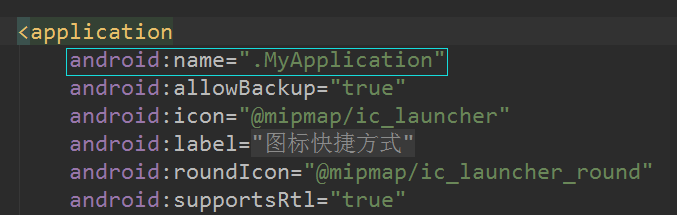

# ShortCuts的使用

[TOC]

先上效果图:

  

使用的第三方库,github地址:

~~~~
https://github.com/MatthiasRobbers/shortbread
~~~~

## 使用

注意:android7.1及以上才有效果.

### 添加依赖:

~~~~JAVA
compile 'com.github.matthiasrobbers:shortbread:1.0.2'
annotationProcessor 'com.github.matthiasrobbers:shortbread-compiler:1.0.2'
~~~~

### 自定义Application

~~~~JAVA
public class MyApplication extends Application {

    @Override
    public void onCreate() {
        super.onCreate();
        //一定要加!
        Shortbread.create(this);
    }
}
~~~~

然后在AndroidManifest.xml中添加application:

  

### 在Activity中添加注解

​	先来创建三个activity.

~~~~JAVA
@Shortcut(id = "main",action = "open_main", icon = R.mipmap.ic_launcher_round, rank =             1,shortLabel = "去主页")
public class MainActivity extends AppCompatActivity {

    @Override
    protected void onCreate(Bundle savedInstanceState) {
        super.onCreate(savedInstanceState);
        setContentView(R.layout.activity_main);
    }

    @Shortcut(id = "main_method",action = "open_main_method", icon=R.mipmap.ic_launcher,         rank = 2,shortLabel = "去主页的方法中",disabledMessage = "传个消息,不知道有什么用")
    public void shortCutsToThis(){
        ((TextView)findViewById(R.id.tv_main)).setText("从ShortCuts跳到这个方法");
    }
}
~~~~

`@Shortcut`可以在类上也可以在方法上,如上图代码,分别在类和代码上, 如下图所示:

 

其中`shortLabel`为长按的时候显示的文字信息,如上图所示的"去主页". `rank`为优先级,rank值越小,离图标就越近.

下面看第二个Activity的代码:

~~~~JAVA
@Shortcut(id = "two",action = "open_two", icon = R.mipmap.ic_launcher_round, rank =          3,shortLabel = "去第二页",backStack = {MainActivity.class,Main3Activity.class})
public class Main2Activity extends AppCompatActivity {

    @Override
    protected void onCreate(Bundle savedInstanceState) {
        super.onCreate(savedInstanceState);
        setContentView(R.layout.activity_main2);
    }
}

~~~~

注意:其中有个`backStack`属性,当在此activity点击返回键时,会回退到`backStack`属性设置的栈中,从后向前依次回退.如下图:

  

点击返回时,会先返回到Main3Activity,再点返回回到MainAcitity.