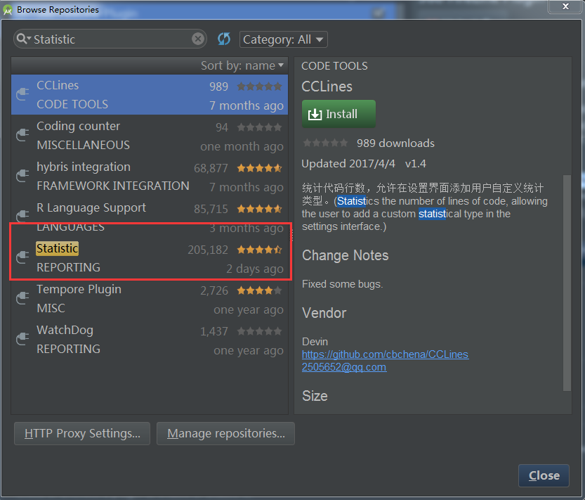
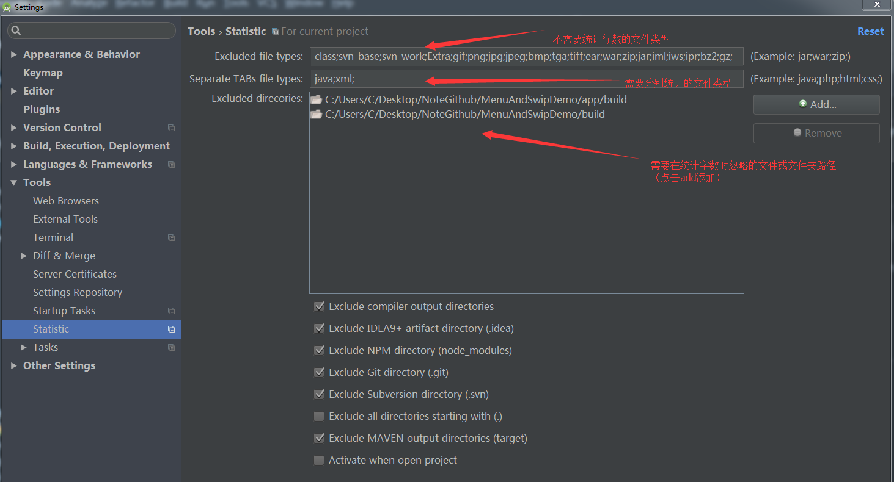
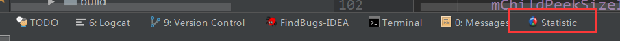
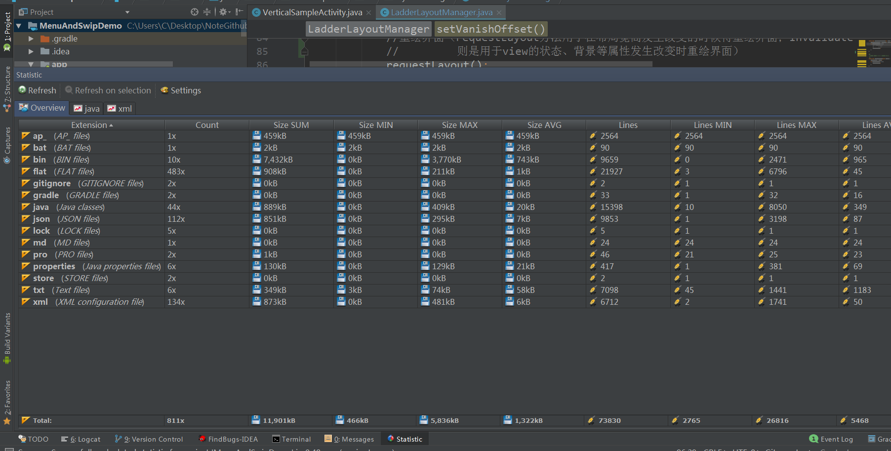

# android studio查询代码行数的插件

[TOC]

## 安装

File --> Settings --> Plugins  --> Browse repositories...      

搜索Statistic ，点击安装即可。

 

## 使用

提示：本文用的最新版的：Statistic-3.4。

打开不同项目的时候，需要设置Statistic：File --> Settings --> Tools --> Statistic。

设置如下图：

 

设置完成之后android studio左下角点击`Statistic`

 

然后点击Refresh即可。 

java和xml就是我们设置时选的分类。