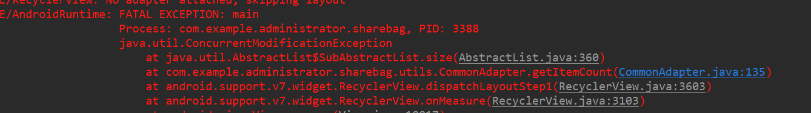

## concurrentmodificationexception异常

[TOC]

下面来看一下报错信息:

 

这个异常出现的原因是在遍历list的时候对list进行增删等操作,抛出的异常. 但是检查发现,我的代码没有相关的操作啊,这是怎么回事啊?而且只是在6.0的系统上抛出这个异常,这是怎么回事呢? (看AbstractList的api只在api23中抛出这个异常)

首先,来说一下业务,我在recyclerview中加入一个头布局,头布局中有三个recyclerview,然后添加ItemDecoration做类似手机通讯录那种效果.问题出来了,我做的时候和平时一样,先处理数据,在初始化adapter,就是这一步出问题了.

因为我在对数据截取的时候使用了subList()方法,然后初始adapter的时候,这个方法是异步处理,还没处理完成,导致在6.0的系统上抛出了这个异常.

~~~~java
 mData2 = mTempData.subList(0, 5);
~~~~

解决方法:

我们手动遍历截取就好.