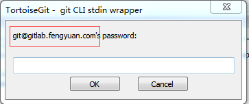
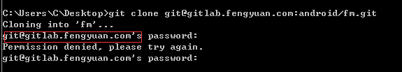
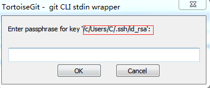
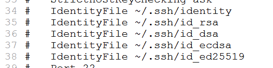

### 本地搭建的GitLab

[TOC]

#### 电脑端配置

C:\Windows\System32\drivers\etc\hosts添加配置信息,如:192.168.10.100   gitlab.fengyuan.com,然后就可以网页登录gitlab了.

### git使用时的问题

#### 使用ssh克隆项目时,输入密码,显示Permission Denied(权限被拒绝)

下面是clone时让输入密码时的情况:

  

这就表示ssh没有配置好,配置好的弹窗如下:

 

下列三种情况会导致出现此问题:

1.gitlab网页端没有配置ssh密钥.

2.生成公钥和私钥的文件名不是默认的.

3.生成密钥的时候的地址不是默认地址.

解决方法:

问题一的解决方法是:找到生成的公钥粘贴上去

默认密钥生成路径为C:\Users\用户名\\.ssh. 

问题二和问题三的解决方法是:修改ssh配置文件的生成的文件名和路径,路径是:Git\etc\ssh\ssh_config

 