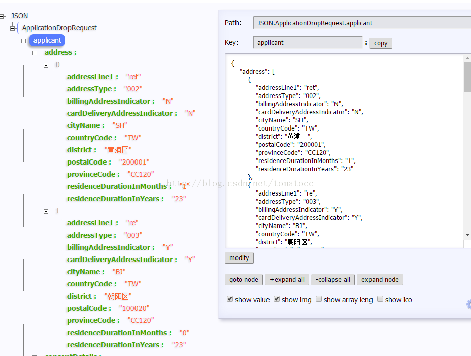

# 两种好用的json工具

标签（空格分隔）： 开发工具

---

###软件:hellojson
 注意:当字段为null的时候在hellojson上会不显示,看不到字段.

###浏览器插件:JSON-Handle
下载地址:http://jsonhandle.sinaapp.com/
插件已经在此文件夹中,插件下载后，在浏览器输入：chrome://extensions/将下载后的文件拖入chrome浏览器即可.
 

