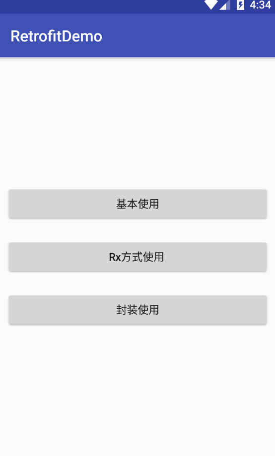

# Rxjava+Retrofit的简单使用

标签（空格分隔）： retrofit+Rxjava

---
###目录
[TOC]
先上效果图:

 

###添加依赖

    compile 'com.squareup.retrofit2:retrofit:2.3.0'
    compile 'com.squareup.retrofit2:converter-gson:2.3.0'
    compile 'com.squareup.retrofit2:adapter-rxjava2:2.3.0'
    compile 'com.squareup.okhttp3:logging-interceptor:3.8.0'
    compile 'io.reactivex.rxjava2:rxandroid:2.0.1' 

###基本使用
1.新建Constant类,添加接口地址
    public class Constant {

    /**
     * 服务器地址
     */
    public static final String SERVER_URL = "http://www.kuaidi100.com/";
    
    /**
     * 接口请求地址
     */
    public static class UrlOrigin {
        /**
         * 获取快递信息
         */
        public static final String get_post_info = "query";
    }
 }

`SERVER_URL`是基类地址,`get_post_info`是这个接口的地址.
2.新建抽象类RetrofitService
​    
    public interface RetrofitService {
    /**
     * 获取快递信息
     * Rx方式
     *
     * @param type   快递类型
     * @param postid 快递单号
     * @return Observable<PostInfo>
     */
    @GET(Constant.UrlOrigin.get_post_info)
    Observable<PostInfo> getPostInfoRx(@Query("type") String type, @Query("postid") String postid);
}

`@GET`中写这个接口的url地址(除了基类之外的部分),一般情况下getPostInfoRx中的形参的注解都用`@Query`.
`PostInfo`是我们自己建的Javabean.
**注意: 如果要是和Rxjava一起用,返回的应该是`Observable<javabean>`,如果只是retrofit单独使用,返回的是`Call<javabean>`**
下面说下参数的注解:

  **@Query**

    @GET("query")
    Call<PostInfo> getPostInfo(@Query("type") String type, @Query("postid") String postid);
相当于

    @GET(query?type=type&postid=postid)
    Call<PostInfo> getPostInfo(@Query("type") String type, @Query("postid") String postid);

**@QueryMap**
当参数较多时,可以传入map集合
​        
​        

    @GET("query")
    Call<Book> getSearchBook(@QueryMap Map<String, String> parameters);

**@Path**
用于替换url中的某些字段，当url中字段不确定时可以使用.即当地址中有需要变动的地址时.

    @GET("group/{id}/users")
    Call<List<User>> groupList(@Path("id") int groupId);
`groupList()`方法中传入的这个id就是`@GET`中{}中的值,如果需要请求参数,可以在`groupList()`中用`@Query`中拼接

    @GET("group/{id}/users")
    Call<List<User>> groupList(@Path("id") int groupId, @Query("sort") String sort);
**@Body**
请求参数使用实体类,retrofit会帮我们转换.

    @POST("users/new")
    Call<User> createUser(@Body User user);
传入我们自己建的`User`类.
**@FormUrlEncoded/@Field**
传送表单数据

    @FormUrlEncoded
    @POST("user/edit")
    Call<User> updateUser(@Field("first_name") String first, @Field("last_name") String last);
需要在头部需要加上@FormUrlEncoded，first_name代表key，first代表value.
**@Multipart/@Part**
用于上传文件 

    @Multipart
    @PUT("user/photo")
    Call<User> updateUser(@Part("photo") RequestBody photo, @Part("description") RequestBodydescription);
**@Header/@Headers**
用于设置请求头

    @GET("user")
    Call<User> getUser(@Header("Authorization") String authorization)

也可以通过`@Headers`设置

    @Headers("Cache-Control: max-age=640000")
    @GET("widget/list")
    Call<List<Widget>> widgetList();
或者

    @Headers({
    "Accept: application/vnd.github.v3.full+json",
    "User-Agent: Retrofit-Sample-App"
     })
    @GET("users/{username}")
    Call<User> getUser(@Path("username") String username);
3.创建打印log工具类
    public class RetrofitUtils {

    /**
     * 获取OkHttpClient
     * 用于打印请求参数
     *
     * @return OkHttpClient
     */
    public static OkHttpClient getOkHttpClient() {
        // 日志显示级别
        HttpLoggingInterceptor.Level level = HttpLoggingInterceptor.Level.BODY;
        // 新建log拦截器
        HttpLoggingInterceptor loggingInterceptor = new HttpLoggingInterceptor(new HttpLoggingInterceptor.Logger() {
            @Override
            public void log(String message) {
                Log.i("http请求参数：", message);
            }
        });
        loggingInterceptor.setLevel(level);
        // 定制OkHttp
        OkHttpClient.Builder httpClientBuilder = new OkHttpClient.Builder();
        // OkHttp进行添加拦截器loggingInterceptor
        httpClientBuilder.addInterceptor(loggingInterceptor);
        return httpClientBuilder.build();
        }
    }
4.最后,开始网络请求.

     private void requestHttp() {
        Retrofit retrofit = new Retrofit.Builder()
                .baseUrl(Constant.SERVER_URL)
                .addConverterFactory(GsonConverterFactory.create())
                .addCallAdapterFactory(RxJava2CallAdapterFactory.create()) // 支持RxJava
                .client(RetrofitUtils.getOkHttpClient()) // 打印请求参数
                .build(); 
        RetrofitService service = retrofit.create(RetrofitService.class);
        Observable<PostInfo> observable = service.getPostInfoRx("yuantong", "11111111111");
        observable.subscribeOn(Schedulers.io()) // 在子线程中进行Http访问
                .observeOn(AndroidSchedulers.mainThread()) // UI线程处理返回接口
                .subscribe(new Observer<PostInfo>() {  // 订阅
                    @Override
                    public void onSubscribe(@NonNull Disposable d) {
    
                    }
    
                    @Override
                    public void onNext(@NonNull PostInfo postInfo) {
                        //拿到postInfo的数据,开始绑定数据操作
                    }
    
                    @Override
                    public void onError(@NonNull Throwable e) {
    
                    }
    
                    @Override
                    public void onComplete() {
    
                    }
                });
    } 
我们只需要在`onNext()`方法中拿到javabean,做操作就好了.
