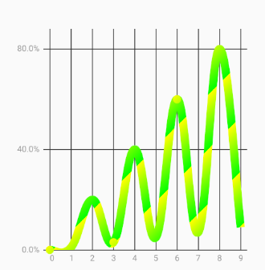

##指定特定位置的圆点的显示

### 先看效果图

 

### 源码修改

我们知道，MPAndroidChart这个依赖库的图表的所有绘制都在renderer中，所有我们找到LineChartRender，找到drawCircles（）方法，这就是绘制圆点的方法，好了，现在开始修改。

1.复制LineChartRender，命名为LineChartCircleRenderer，添加代码：

~~~~JAVA
	/**
     * 显示原点的x轴的对应的数组
     */
    private static List<Integer> mCirclePointPositions = new ArrayList<>();

    /**
     * 设置显示哪个x轴对应的原点
     *
     * @param positions 显示原点的数据所在的位置的集合
     */
    public static void setCirclePoints(List<Integer> positions) {
        mCirclePointPositions = positions;
    }
~~~~

修改drawCircles()方法：

~~~~JAVA
	/**
     * 画圆点  -- x轴值对应的y值的小圆圈
     *
     * @param c
     */
    protected void drawCircles(Canvas c) {

        mRenderPaint.setStyle(Paint.Style.FILL);

        float phaseY = mAnimator.getPhaseY();

        mCirclesBuffer[0] = 0;
        mCirclesBuffer[1] = 0;

        List<ILineDataSet> dataSets = mChart.getLineData().getDataSets();

        for (int i = 0; i < dataSets.size(); i++) {

                ILineDataSet dataSet = dataSets.get(i);
                if (!dataSet.isVisible() || !dataSet.isDrawCirclesEnabled() ||
                        dataSet.getEntryCount() == 0)
                    continue;

                mCirclePaintInner.setColor(dataSet.getCircleHoleColor());

                Transformer trans = mChart.getTransformer(dataSet.getAxisDependency());

                mXBounds.set(mChart, dataSet);

                float circleRadius = dataSet.getCircleRadius();
                float circleHoleRadius = dataSet.getCircleHoleRadius();
                boolean drawCircleHole = dataSet.isDrawCircleHoleEnabled() &&
                        circleHoleRadius < circleRadius &&
                        circleHoleRadius > 0.f;
                boolean drawTransparentCircleHole = drawCircleHole &&
                        dataSet.getCircleHoleColor() == ColorTemplate.COLOR_NONE;

                DataSetImageCache imageCache;

                if (mImageCaches.containsKey(dataSet)) {
                    imageCache = mImageCaches.get(dataSet);
                } else {
                    imageCache = new DataSetImageCache();
                    mImageCaches.put(dataSet, imageCache);
                }

                boolean changeRequired = imageCache.init(dataSet);

                // only fill the cache with new bitmaps if a change is required
                if (changeRequired) {
                    imageCache.fill(dataSet, drawCircleHole, drawTransparentCircleHole);
                }

                int boundsRangeCount = mXBounds.range + mXBounds.min;

                for (int j = mXBounds.min; j <= boundsRangeCount; j++) {
                    // TODO: 2017/11/13 改动位置
                    if (mCirclePointPositions.contains(j)) {
                        Entry e = dataSet.getEntryForIndex(j);
                        if (e == null)
                            break;

                        mCirclesBuffer[0] = e.getX();
                        mCirclesBuffer[1] = e.getY() * phaseY;

                        trans.pointValuesToPixel(mCirclesBuffer);

                        if (!mViewPortHandler.isInBoundsRight(mCirclesBuffer[0]))
                            break;

                        if (!mViewPortHandler.isInBoundsLeft(mCirclesBuffer[0]) ||
                                !mViewPortHandler.isInBoundsY(mCirclesBuffer[1]))
                            continue;

                        Bitmap circleBitmap = imageCache.getBitmap(j);

                        if (circleBitmap != null) {
                            c.drawBitmap(circleBitmap, mCirclesBuffer[0] - circleRadius, mCirclesBuffer[1] - circleRadius, null);
                        }
                    }
                }
            }
        }
~~~~

其实就是在`Entry e = dataSet.getEntryForIndex(j);`外包加了一层我们写的if判断，判断只有当位置是我们传入的列表的位置时，才显示。

2.复制LineChart，命名为LineCircleChart，把所有的LineChartRender替换成LineChartCircleRenderer。

~~~~java
public class LineCircleChart extends BarLineChartBase<LineData> implements 		  LineDataProvider {

    public LineCircleChart(Context context) {
        super(context);
    }

    public LineCircleChart(Context context, AttributeSet attrs) {
        super(context, attrs);
    }

    public LineCircleChart(Context context, AttributeSet attrs, int defStyle) {
        super(context, attrs, defStyle);
    }

    @Override
    protected void init() {
        super.init();

        mRenderer = new LineChartCircleRenderer(this, mAnimator, mViewPortHandler);
    }

    @Override
    public LineData getLineData() {
        return mData;
    }

    @Override
    protected void onDetachedFromWindow() {
        // releases the bitmap in the renderer to avoid oom error
        if (mRenderer != null && mRenderer instanceof LineChartCircleRenderer) {
            ((LineChartCircleRenderer) mRenderer).releaseBitmap();
        }
        super.onDetachedFromWindow();
    }
}
~~~~

3.使用线性图的时候使用刚改好的LineCircleChart，并调用我们在renderer中添加的方法。

~~~~JAVA
		//设置那几个位置的圆点显示
        List<Integer> position = new ArrayList<>();
        position.add(0);
        position.add(3);
        position.add(6);
        LineChartCircleRenderer.setCirclePoints(position);
~~~~

注意：使用的时候请注意是否开启绘制圆点：

~~~~JAVA
  		//绘制x轴对应的y轴数据值的圆点
        lineDataSet.setDrawCircles(true);
        //绘制的圆点是否是空心
        lineDataSet.setDrawCircleHole(false);
        //圆点的填充颜色
        lineDataSet.setCircleColor(Color.BLACK);
        //圆点的半径
        lineDataSet.setCircleRadius(5f);
~~~~

特别强调：文中使用的是3.0.2版本的MPAndroid。

demo源码位置：https://github.com/chinachance/ChartCubeDemo

## 颜色渐变

 

在renderer中找到画的方法，修改：

~~~~JAVA
 		//修改-------start
        mRenderPaint.setColor(dataSet.getColor()); //注释掉
        //添加
        LinearGradient linearGradient = new LinearGradient(0, 0, 100, 100, new int[] {
                Color.YELLOW, Color.GREEN }, null,
                Shader.TileMode.REPEAT);
        mRenderPaint.setShader(linearGradient);
        //修改-------end
~~~~

## 选中显示小圆点，并且修改高亮线

修改后的文件为`LineUpdateHightLightChart`,`LineChartUpdateHightLightRenderer`,`LineRadarRendererTwo`,`LineScatterCandleRadarRendererTwo`

然后引用线状图的时候用`LineUpdateHightLightChart`这个我们改好的chart，然后设置`setHighlightEnabled(true`)`,最后还需调用我们写好的`setCircleWidth()`方法，把小园的半径和橘色圆环的宽度传过去：

~~~~java
chart.setCircleWidth(DensityUtils.dip2px(this, 6), DensityUtils.dip2px(this, 2));
~~~~

## 其他属性

~~~~java
//屏幕最多展示x轴的数据为6个，其余的滑动显示
lineChart.setVisibleXRange(0, 5);
//图标数据最后一个的x值和y值
float xChartMax = chart.getXChartMax();
float yChartMax = chart.getYChartMax();
//滑动到图表指定的位置-----这样设置，指定的位置会滑动到图表能看到的位置的最右边
lineChart.moveViewTo(xChartMax, yChartMax, YAxis.AxisDependency.LEFT);
//滑动到图表指定的位置-----这样设置，指定的位置会滑动到图表能看到的位置的最左边
lineChart.moveViewToX(xChartMax);
//设置x轴数据左右的偏移量(图表左右显示不全时使用)
lineChart.setDragOffsetX(6f);

//设置x轴第一个数据和最好一个数据加上边距
xAxis.setAvoidFirstLastClipping(true);

//图表监听
lineChart.setOnChartGestureListener(new OnChartGestureListener() {
            @Override
            public void onChartGestureStart(MotionEvent me, ChartTouchListener.ChartGesture lastPerformedGesture) {
                Log.v("hao", "SaleManMonthStaticActivity onChartGestureStart()");
            }

            @Override
            public void onChartGestureEnd(MotionEvent me, ChartTouchListener.ChartGesture lastPerformedGesture) {

            }

            @Override
            public void onChartLongPressed(MotionEvent me) {

            }

            @Override
            public void onChartDoubleTapped(MotionEvent me) {

            }

            @Override
            public void onChartSingleTapped(MotionEvent me) {

            }

            @Override
            public void onChartFling(MotionEvent me1, MotionEvent me2, float velocityX, float velocityY) {
                Log.v("hao", "SaleManMonthStaticActivity onChartFling()");
            }

            @Override
            public void onChartScale(MotionEvent me, float scaleX, float scaleY) {

            }

            @Override
            public void onChartTranslate(MotionEvent me, float dX, float dY) {
                Log.v("hao", "SaleManMonthStaticActivity onChartTranslate()");
            }
        });
~~~~

自定义Markview监听，在自定义的Markview的`refreshContent()`方法中：

~~~~java
	    @Override
        public void refreshContent(Entry e, Highlight highlight) {
            if (e != null) {
                EventBus.getDefault().post(new ChartSelectEvent((int) e.getX()));
            }
            super.refreshContent(e, highlight);
        }
~~~~

