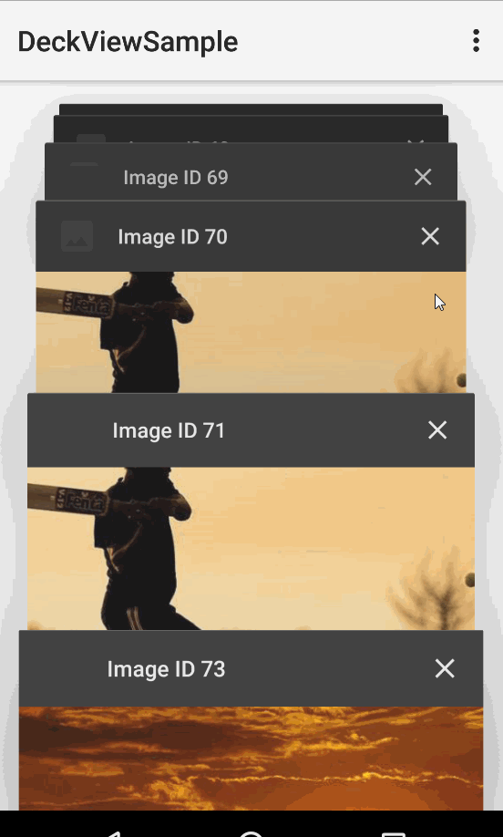

# 手机多任务键效果的实现--卡片堆叠、滑动、侧滑删除

[TOC]

## 效果

 

## 代码

~~~~java
public class Datum implements Parcelable {

    public int id;
    public String headerTitle, link;
    public Target target;

    public Datum() {
    }

    @Override
    public int describeContents() {
        return 0;
    }

    public Datum(Parcel in) {
        readFromParcel(in);
    }

    public void readFromParcel(Parcel in) {
        id = in.readInt();
        headerTitle = in.readString();
        link = in.readString();
    }

    @Override
    public void writeToParcel(Parcel dest, int flags) {
        dest.writeInt(id);
        dest.writeString(headerTitle);
        dest.writeString(link);
    }

    public static final Creator<Datum> CREATOR = new Creator<Datum>() {
        public Datum createFromParcel(Parcel in) {
            return new Datum(in);
        }

        public Datum[] newArray(int size) {
            return new Datum[size];
        }
    };

    @Override
    public boolean equals(Object o) {
        return ((Datum) o).id == this.id;
    }
}
~~~~

~~~~java
public class DeckViewSampleActivity extends Activity {
    
    DeckView<Datum> mDeckView;

    Drawable mDefaultHeaderIcon;
    ArrayList<Datum> mEntries;

    // item图片未加载完成时的占位符
    Bitmap mDefaultThumbnail;

    // 保留配置更改的位置
    // 图片地址 http://lorempixel.com
    int scrollToChildIndex = -1, imageSize = 500;

    // SavedInstance bundle的keys
    final String CURRENT_SCROLL = "current.scroll", CURRENT_LIST = "current.list";
    private static int KEY = 0;

    @Override
    protected void onCreate(Bundle savedInstanceState) {
        super.onCreate(savedInstanceState);
        setContentView(R.layout.activity_deck_view_sample);

        mDeckView = (DeckView) findViewById(R.id.deckview);
        //图片占位符的bitmap
        mDefaultThumbnail = BitmapFactory.decodeResource(getResources(),
                R.drawable.default_thumbnail);
        //item左上角的logo
        mDefaultHeaderIcon = getResources().getDrawable(R.drawable.default_header_icon);

        //拿到savedInstanceState存储的数据
        if (savedInstanceState != null) {
            if (savedInstanceState.containsKey(CURRENT_LIST)) {
                mEntries = savedInstanceState.getParcelableArrayList(CURRENT_LIST);
            }

            if (savedInstanceState.containsKey(CURRENT_SCROLL)) {
                scrollToChildIndex = savedInstanceState.getInt(CURRENT_SCROLL);
            }
        }

        //设置item数据
        if (mEntries == null) {
            mEntries = new ArrayList<>();
            for (int i = 1; i < 100; i++) {
                Datum datum = new Datum();
                datum.id = generateUniqueKey();
                datum.link = "http://lorempixel.com/" + imageSize + "/" + imageSize
                        + "/sports/" + "ID " + datum.id + "/";
                datum.headerTitle = "Image ID " + datum.id;
                mEntries.add(datum);
            }
        }

        // 回调
        DeckView.Callback<Datum> deckViewCallback = new DeckView.Callback<Datum>() {
            @Override
            public ArrayList<Datum> getData() {
                return mEntries;
            }

            /**
             * 加载图片
             * @param dcv
             * @param item
             */
            @Override
            public void loadViewData(WeakReference<DeckChildView<Datum>> dcv, Datum item) {
                loadViewDataInternal(item, dcv);
            }

            /**
             * 取消加载图片
             * @param item
             */
            @Override
            public void unloadViewData(Datum item) {
                Picasso.with(DeckViewSampleActivity.this).cancelRequest(item.target);
            }

            @Override
            public void onViewDismissed(Datum item) {
                mEntries.remove(item);
                mDeckView.notifyDataSetChanged();
            }

            @Override
            public void onItemClick(Datum item) {
                Toast.makeText(DeckViewSampleActivity.this,
                        "Item with title: '" + item.headerTitle + "' clicked",
                        Toast.LENGTH_SHORT).show();
            }

            @Override
            public void onNoViewsToDeck() {
                Toast.makeText(DeckViewSampleActivity.this,
                        "No views to show",
                        Toast.LENGTH_SHORT).show();
            }
        };

        mDeckView.initialize(deckViewCallback);

        if (scrollToChildIndex != -1) {
            mDeckView.post(new Runnable() {
                @Override
                public void run() {
                    // Restore scroll position
                    mDeckView.scrollToChild(scrollToChildIndex);
                }
            });
        }
    }

    /**
     * 加载图片
     * @param datum
     * @param weakView
     */
    void loadViewDataInternal(final Datum datum,
                              final WeakReference<DeckChildView<Datum>> weakView) {
        // datum.target一定为空，先取消加载图片
        Picasso.with(DeckViewSampleActivity.this).cancelRequest(datum.target);

        datum.target = new Target() {
            @Override
            public void onBitmapLoaded(Bitmap bitmap, Picasso.LoadedFrom from) {
                // 用Picasso 加载图片的Bitmap
                if (weakView.get() != null) {
                    //参数：数据；图片bitmap；左上角图标；标题；标题背景色
                    weakView.get().onDataLoaded(datum, bitmap,
                            mDefaultHeaderIcon, datum.headerTitle, Color.DKGRAY);
                }
            }

            @Override
            public void onBitmapFailed(Drawable errorDrawable) {
                //加载失败
                if (weakView.get() != null) {
                    weakView.get().onDataLoaded(datum, mDefaultThumbnail,
                            mDefaultHeaderIcon, datum.headerTitle + " Failed", Color.DKGRAY);
                }
            }

            @Override
            public void onPrepareLoad(Drawable placeHolderDrawable) {
                //加载中
                if (weakView.get() != null) {
                    weakView.get().onDataLoaded(datum, mDefaultThumbnail,
                            mDefaultHeaderIcon, "Loading...", Color.DKGRAY);
                }
            }
        };

        //开始请求
        Picasso.with(DeckViewSampleActivity.this).load(datum.link).into(datum.target);
    }

    @Override
    public boolean onCreateOptionsMenu(Menu menu) {
        getMenuInflater().inflate(R.menu.menu_deck_view_sample, menu);
        return true;
    }

    @Override
    public boolean onOptionsItemSelected(MenuItem item) {
        int id = item.getItemId();
        
        if (id == R.id.action_add) {
            Datum datum = new Datum();
            datum.id = generateUniqueKey();
            datum.headerTitle = "(New) Image ID " + datum.id;
            datum.link = "http://lorempixel.com/" + imageSize + "/" + imageSize
                    + "/sports/" + "ID " + datum.id + "/";
            mEntries.add(datum);
            mDeckView.notifyDataSetChanged();
            return true;
        } else if (id == R.id.action_add_multiple) {
            Random rand = new Random();
            
            int numberOfItemsToAdd = rand.nextInt(6) + 5;

            for (int i = 0; i < numberOfItemsToAdd; i++) {
                int atIndex = mEntries.size() > 0 ?
                        rand.nextInt(mEntries.size()) : 0;

                Datum datum = new Datum();
                datum.id = generateUniqueKey();
                datum.link = "http://lorempixel.com/" + imageSize + "/" + imageSize
                        + "/sports/" + "ID " + datum.id + "/";
                datum.headerTitle = "(New) Image ID " + datum.id;
                mEntries.add(atIndex, datum);
            }

            mDeckView.notifyDataSetChanged();
            return true;
        }

        return super.onOptionsItemSelected(item);
    }

    @Override
    protected void onSaveInstanceState(Bundle outState) {
        // 用SaveInstanceState存储数据
        int currentChildIndex = mDeckView.getCurrentChildIndex();
        outState.putInt(CURRENT_SCROLL, currentChildIndex);
        outState.putParcelableArrayList(CURRENT_LIST, mEntries);

        super.onSaveInstanceState(outState);
    }
    
    private static int generateUniqueKey() {
        return ++KEY;
    }
    
}

~~~~

代码中都有注释，如有不懂，请看demo。