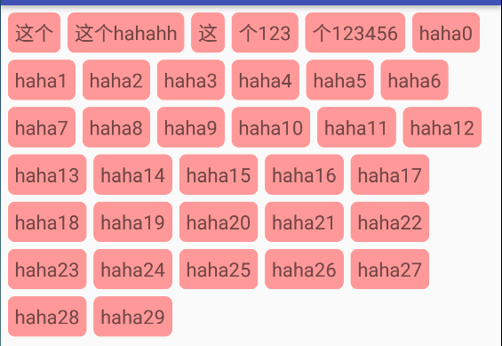

实现下列效果:

 

只需要引入官方的框架就行.

~~~~java
dependencies {
    compile 'com.google.android:flexbox:0.3.0-alpha3'
}
~~~~

然后初始化FlexboxLayoutManager.

~~~~java
FlexboxLayoutManager layoutManager = new FlexboxLayoutManager();
~~~~

就可以了.

其他常用设置:

~~~~java
FlexboxLayoutManager layoutManager = new FlexboxLayoutManager();
        /**
         * 设置排列的方向.(不设置时默认为 ROW)
         * row:主轴为水平方向，起点在左端.
         * row_reverse：主轴为水平方向，起点在右端.
         * column：主轴为垂直方向，起点在上沿.
         * column_reverse：主轴为垂直方向，起点在下沿.
         */
        layoutManager.setFlexDirection(FlexDirection.ROW);
        /**
         * 设置换行方式(不设置时默认为 WRAP)
         * nowrap ：不换行
         * wrap：按正常方向换行
         * wrap_reverse：按反方向换行
         */
        layoutManager.setFlexWrap(FlexWrap.WRAP);
        /**
         * item的对齐方式
         * flex-start：交叉轴的起点对齐
         * flex-end：交叉轴的终点对齐。
         * center：交叉轴的中点对齐。
         * baseline: 项目的第一行文字的基线对齐。
         * stretch（默认值）：如果项目未设置高度或设为auto，将占满整个容器的高度。
         */
        layoutManager.setAlignItems(AlignItems.STRETCH);
~~~~

更多设置:

https://www.jianshu.com/p/b3a9c4a99053