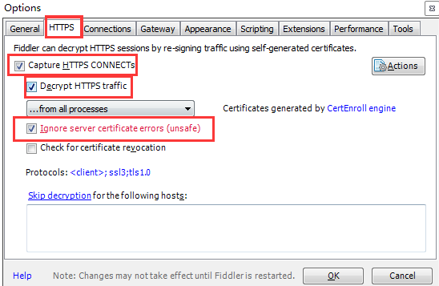
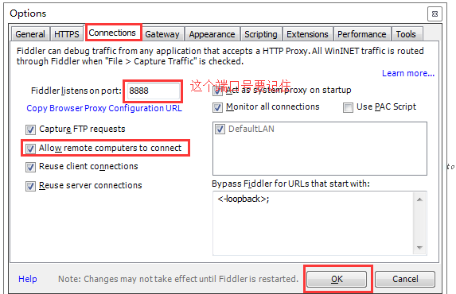
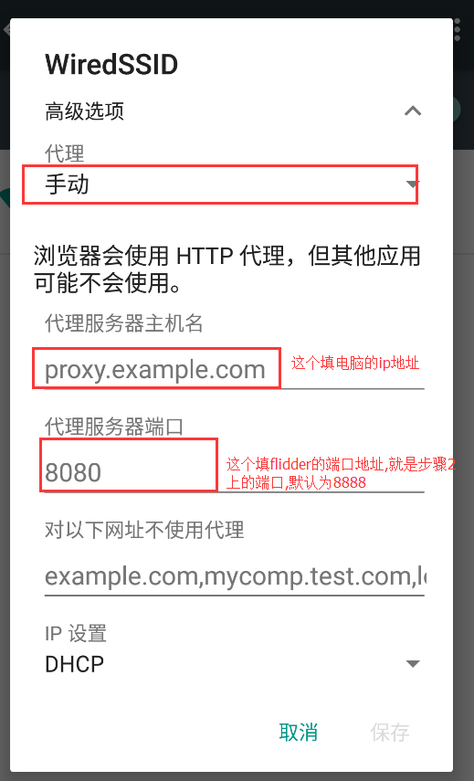

不管测试机还是模拟器,访问不到内网地址时,很可能是电脑上修改hosts了,但是模拟器和测试机没有修改hosts.

## 模拟器修改hosts

使用adb命令修改hosts:

1.先root.  执行命令: 

~~~~
adb root
~~~~

2.设置为可更改用户账户.

~~~~
adb remount
~~~~

3.在android studio中用device file explorer 找到hosts文件( 路径为:system/etc/hosts ) ,导出,然后修改完再导入到原路径.

注意:设置完这三步之后,还是会无法访问.

这是问什么呢?

原来是因为在我们进行人工的插入一条hosts映射的时候,linux内核未识别未识别换行符导致的.

所以请忽略第三步,在1,2步之后,进行如下操作:

1. win+R 启动运行框,输入cmd.

2. 输入:

   ~~~~
   adb shell
   echo -e \\n >> /system/etc/hosts 
   echo 192.168.0.246 www.aaa.com >> /system/etc/hosts
   ~~~~

注意:最后一行的192.168.0.246 www.aaa.com输入你要添加的地址.

然后就可以访问内网的地址了,哈哈.

## 使用测试机连接

当你用真机的时候,想连接但是又不想root,这怎么办呢?不root就没办法修改hosts啊.

这时可以通过设置代理连接.

1.安装好后打开fiddler→选择 Tools >Fildder Options > Https , 把红色框框的都选中.

 

  2.在切换到Connections选项 , Connection勾选允许远程连接.(这个端口号要记住,设置手机的时候要填)

 

  3.win+R 运行,输入cmd ,然后在命令提示符中输入:ipconfig  . (查看电脑的ip地址)

  4.手机连接到和电脑同一局域网内,也就是连接公司的wifi.然后打开手机的设置 --> wifi --> 长按连接的这个内网的wifi --> 选择修改网络 --> 高级.

然后就可以连接内网了,哈哈.

不过要注意一点,当真机需要访问内网时,要一直开着flidder.