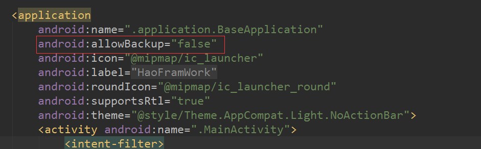
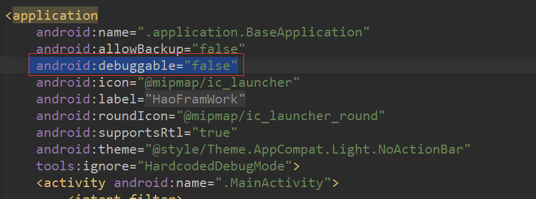
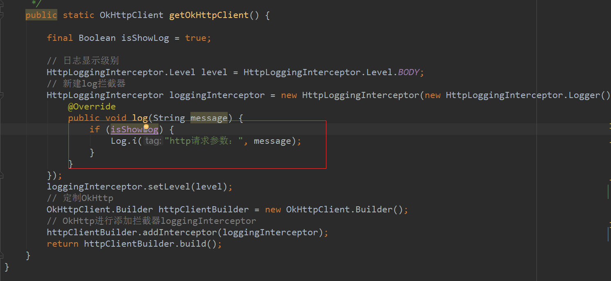

# 项目代码优化笔记

[TOC]

# AndroidManifest相关

### 应用程序备份恢复隐患

​	在AndroidManifest中，**android:allowBackup**属性需要设置为**false**。当allowBackup未设置值（默认值为true）或者标志值为true时，攻击者可通过adb backup和adb restore来备份和恢复应用程序数据。

正确图示：

 

### 可被Debug漏洞

​	android:debuggable属性建议设置为false，当debuggable标志值为true时，该程序可被任意调试，导致APP被恶意攻击者控制。建议显示设置为false。

正确图示：

 

## 代码相关

### 1.尽量使用if()包裹log信息

 

上图还有一点问题，乣把控制日志是否开启的变量写在这个log类中。

### 2.获取当前时间用System.currentTimeMillis()，而不要用new Date().getTime()

### 3.不允许任何魔法值（即未经定义的常量）直接出现在代码中。

​	使用常量前需要先定义。

### 4.集合初始化时，指定集合初始值大小。

​	如：

~~~~JAVA
 Map map = new HashMap();
~~~~

需要改为：

~~~~JAVA
 Map map = new HashMap(16);
~~~~

